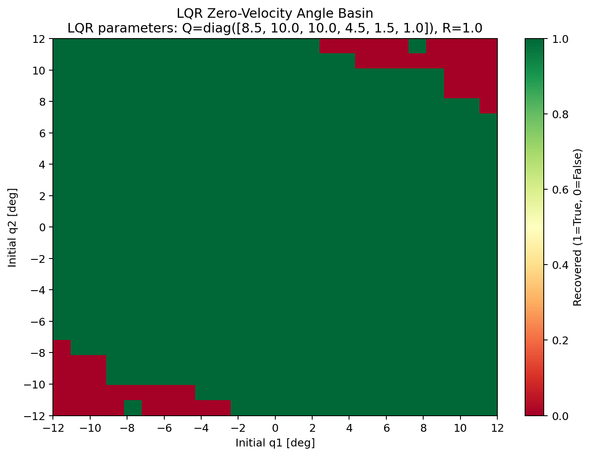
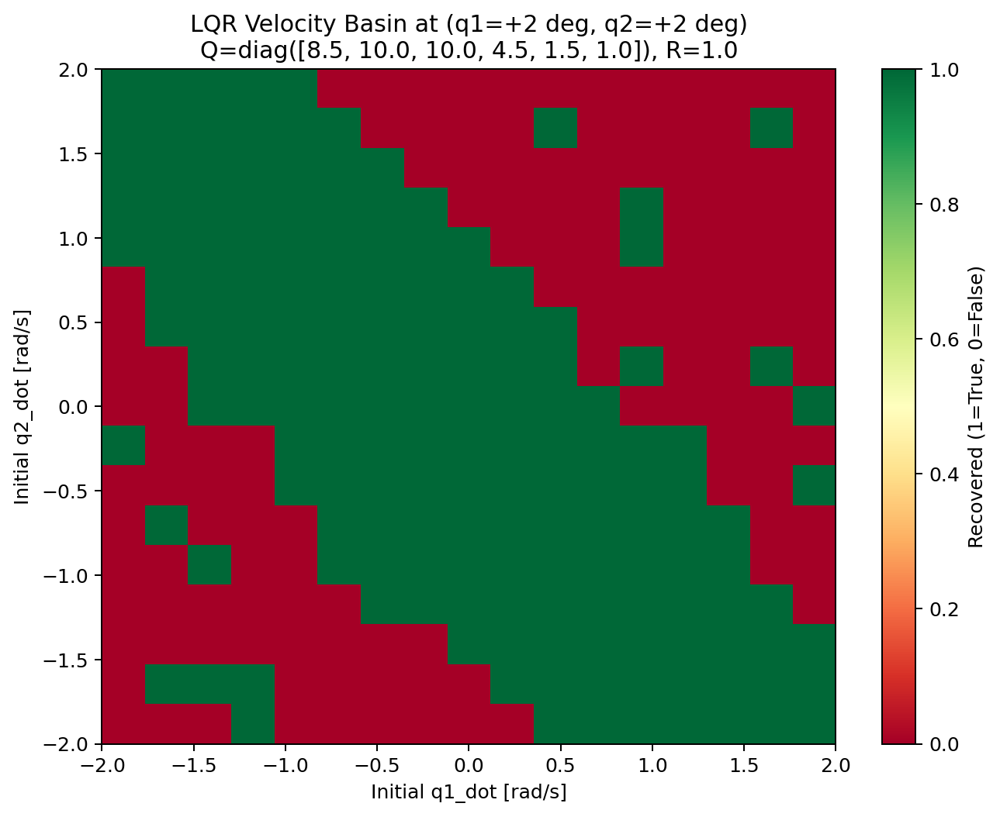
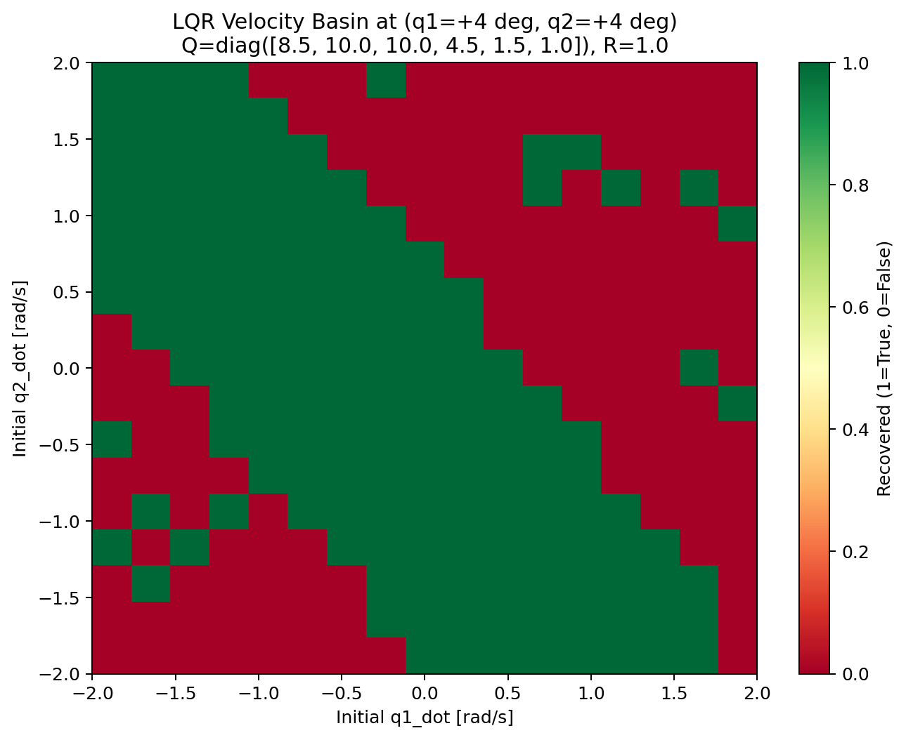
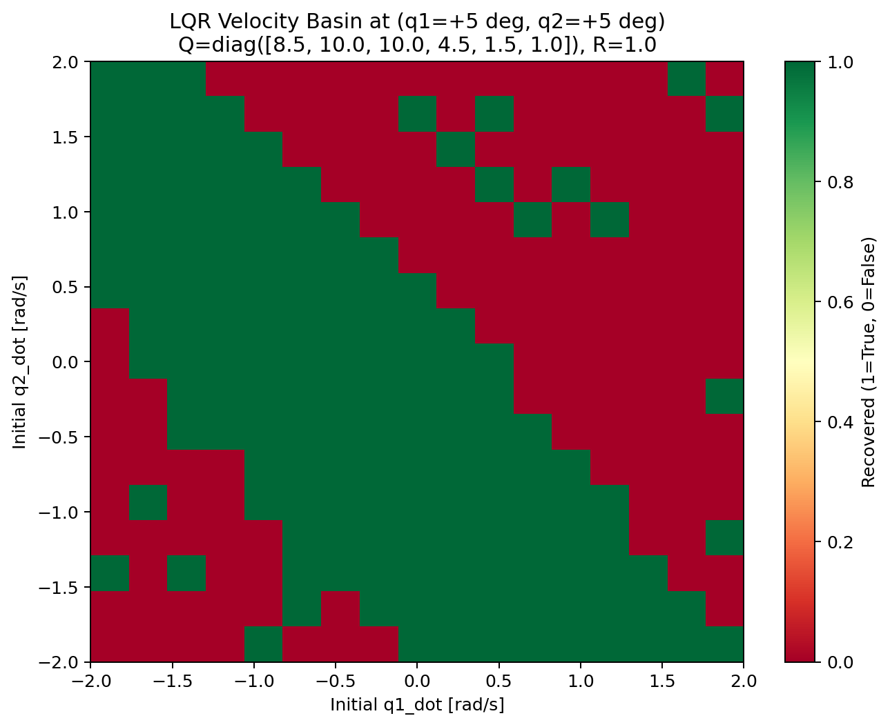
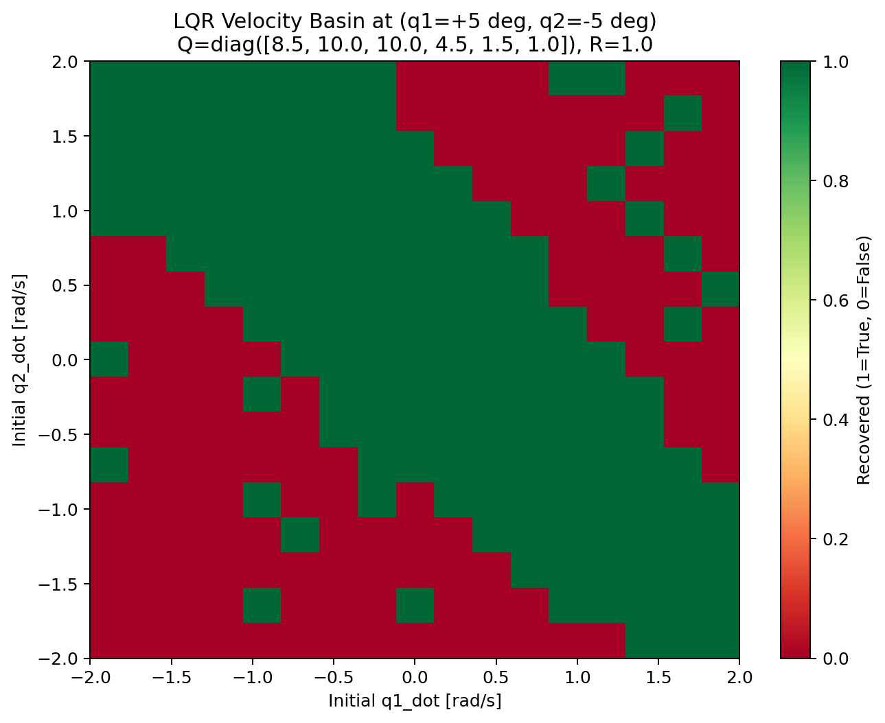
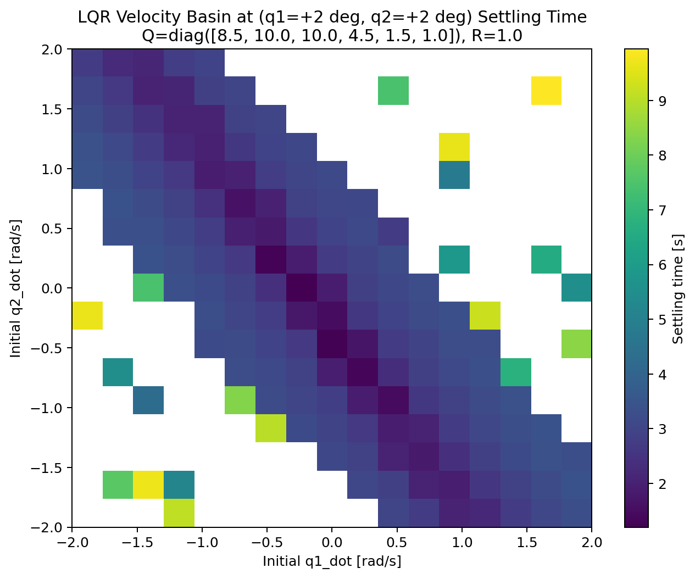
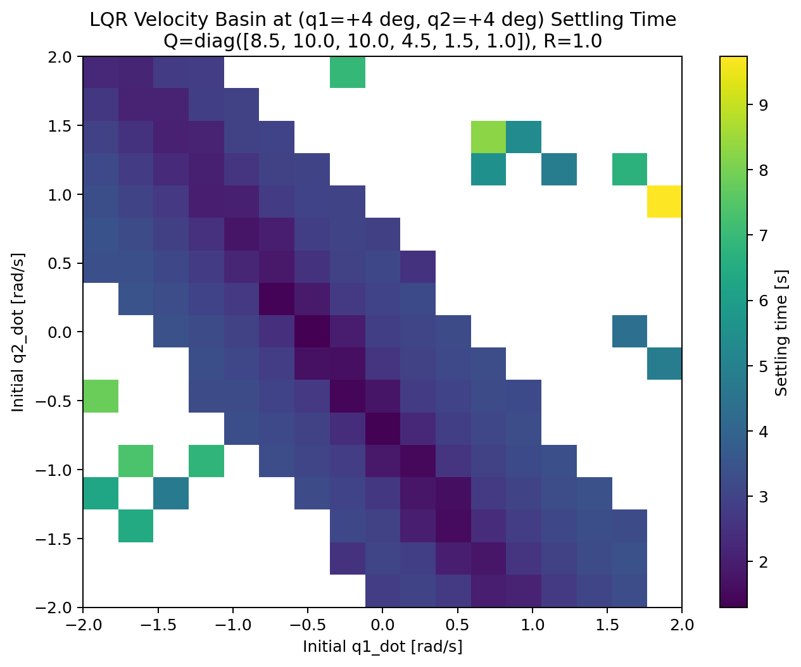
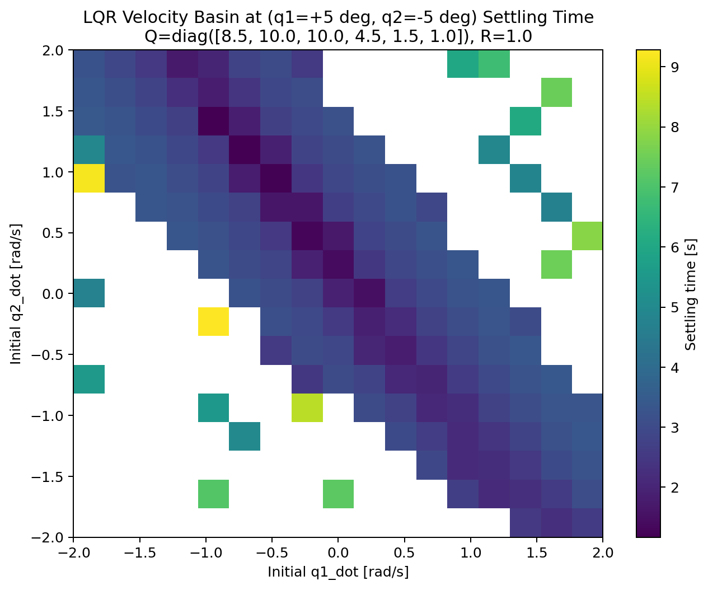

# Appendix

## MuJoCo Simulation Environment

*Figure A1. MuJoCo simulation environment used for controller development and rollout visualization.*

## Simulation Parameters
The simulation parameters are as follows:
- cart track range: approximately `[-2.0, 2.0] m`
- actuator limit: `[-50, 50] N`
- simulation timestep: `0.005 s`
- cart mass: `1.0 kg`
- link 1 length / mass: `0.6 m`, `0.35 kg`
- link 2 length / mass: `0.5 m`, `0.25 kg`

## Supplementary Figures

*Figure A2. Binary success map for the zero-velocity angle basin. This complements the settling-time map in the main report by showing the overall shape of the local LQR recovery region.*

*Figure A3. Velocity-basin success map at the small-angle anchor $(2^\circ, 2^\circ)$. This shows the local recovery structure when the pendulum begins very close to upright.*

*Figure A4. Velocity-basin success map at $(4^\circ, 4^\circ)$. This helps compare how the LQR basin changes as the angle anchor moves farther from upright.*

*Figure A5. Velocity-basin success map at $(5^\circ, 5^\circ)$. This figure is useful for comparing with the $(3^\circ, 3^\circ)$ case discussed in the main report.*

*Figure A6. Velocity-basin success map at the mixed-sign angle anchor $(5^\circ, -5^\circ)$. This shows how the recovery structure changes when the two links begin on opposite sides of upright.*

*Figure A7. Settling-time version of the velocity basin at $(2^\circ, 2^\circ)$ for successful recoveries only.*

*Figure A8. Settling-time version of the velocity basin at $(4^\circ, 4^\circ)$. This highlights how convergence time varies across the local velocity basin.*

*Figure A9. Settling-time version of the velocity basin at $(5^\circ, 5^\circ)$. This figure complements the representative $(3^\circ, 3^\circ)$ case used in the main report.*

*Figure A10. Settling-time map at the mixed-sign anchor $(5^\circ, -5^\circ)$, showing recovery speed for successful cases.*

