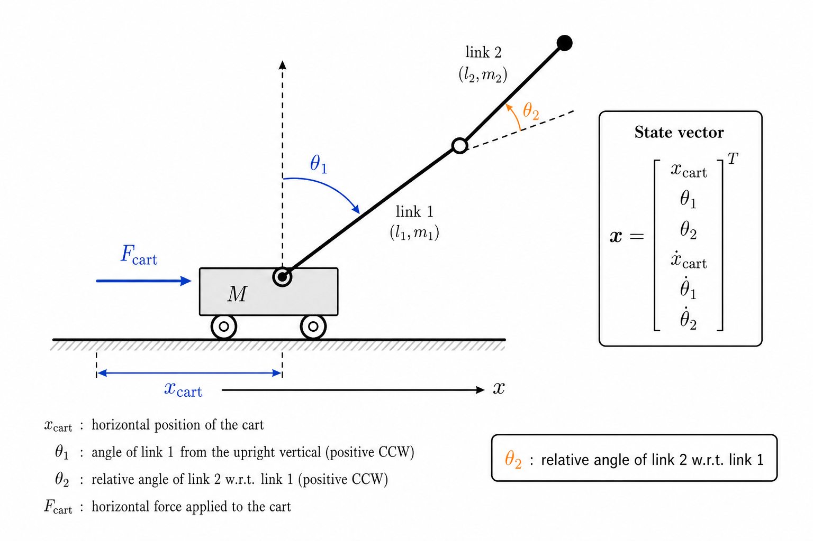
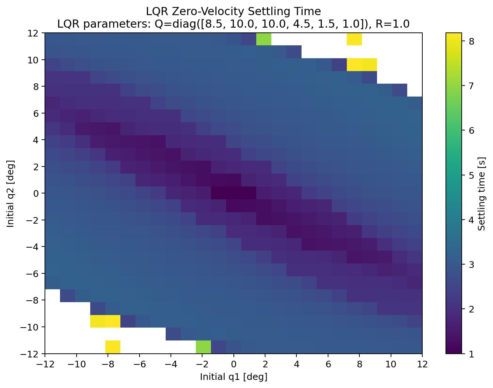
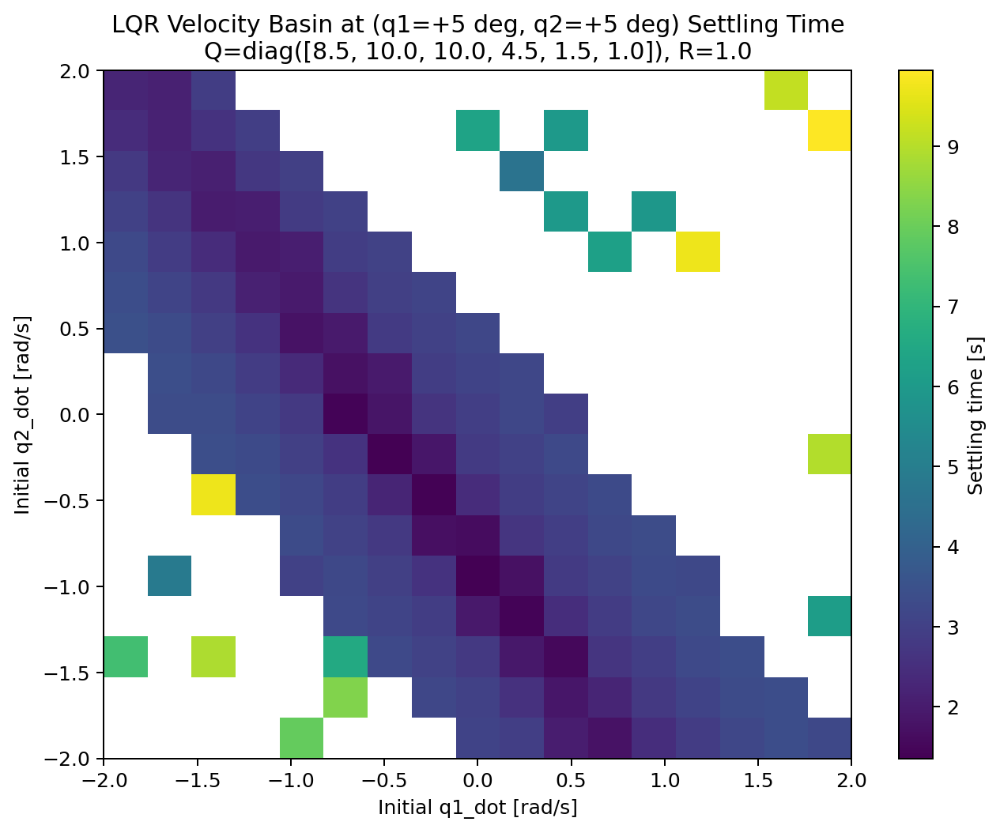
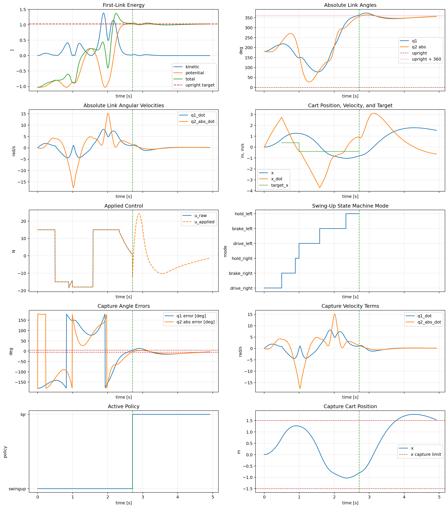
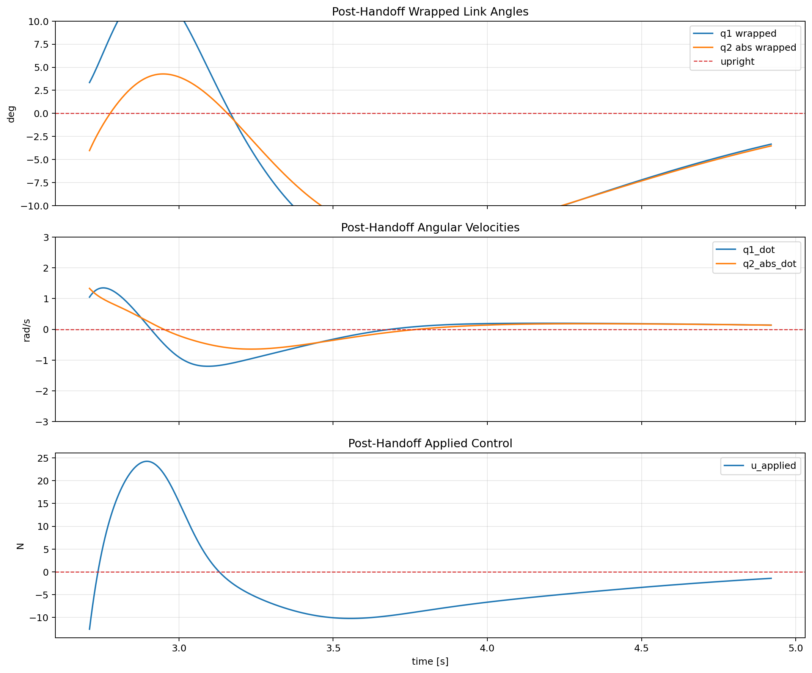

# Inverted Double Pendulum on Cart Swing-Up and Balance

## Introduction
The goal of this project was to control a cart-mounted double pendulum in simulation and drive it to the upright position using only a horizontal force applied to the cart. This is a challenging underactuated control problem because both links must be coordinated through a single actuator. I implemented a two-phase controller: a swing-up policy from rest followed by LQR stabilization near the upright equilibrium. This report summarizes the system model, controller design, and validation results.

## Model and Environment

The plant was modeled in MuJoCo as a planar cart-double-pendulum system with a sliding cart, two pendulum links, and a single horizontal cart actuator. The cart moves along a bounded rail, and each link is connected by a hinge joint.

The system state was defined as follows:

$$
x = [qpos, qvel] =
\begin{bmatrix}
x_{cart} & \theta_1 & \theta_2 & \dot{x}_{cart} & \dot{\theta}_1 & \dot{\theta}_2
\end{bmatrix}^T.
$$

*Figure 1. Planar cart-double-pendulum model and state definition. The second joint angle $\theta_2$ is defined relative to link 1, following the MuJoCo joint convention.*

> Note: $\theta_2$ is defined relative to link 1 rather than in the world frame, following MuJoCo's joint convention.

The control input was a single horizontal cart force:

$$
u = \begin{bmatrix} F_{cart} \end{bmatrix}.
$$

Only the cart is actuated, so both pendulum links must be controlled indirectly through cart motion.

The main modeling assumptions are below:
- The motion was restricted to a planar 2D setting, so out-of-plane dynamics were ignored.
- The cart and pendulum segments were modeled as rigid bodies with fixed masses and lengths.
- The controller had access to the full simulated state, meaning perfect state measurement was assumed with no sensor noise, delay, or state-estimation error.
- The baseline simulation was deterministic, so disturbances and unmodeled effects were not included.

These assumptions capture the essential dynamics of the system while avoiding modeling other dynamics that were less relevant for the controller design problem.

## Controller Design

A key controller design decision was to break the control problem down into distinct control regimes rather than try to build a single controller that performs everything from the swing-up to the balance. This is because the system dynamics are different enough in the swing-up phase and the stabilization phase that the controller needs to produce different control reponses in each phase. Near the upright equilibrium, a local linear controller such as LQR is appropriate. However, from the hanging downwards position at rest, the system must first build enough momentum to reach that upright equilibrium, which requires a different control strategy. Additionally, this introduces another design challenge of how to hand control from the swing-up policy to the local stabilizer when the state is sufficiently close to upright.

### Stabilization Phase

For the stabilization near upright phase, I chose an LQR (linear quadratic regulator) controller.

LQR is a good fit because near the upright equilibrium, the angles and velocities are small enough that the pendulum's nonlinear dynamics can be approximated by a linear model. Additionally, the controller must regulate multiple coupled state errors, such as the motion of both pendulum links, with one actuator. This makes a linear multivariable state-feedback method like LQR appropriate (https://underactuated.mit.edu/lqr.html). 

I also considered other control approaches such as PID and pole placement. PID was not a good fit for this problem because the controller needed to regulate several strongly coupled states at once, such as the cart position, link angles, and angular velocities, and PID is most effective at regulating a scalar error term. Pole placement is also another possible linear multivaraiable state-feedback method, but it has a less intuitive tuning process than LQR because it required choosing desired closed-loop eigenvalues rather than directly penalizing state errors and control effort. LQR provided a better balance of coupled-state regulation, tunability, and implementation simplicity.

With LQR, I modeled the near-upright dynamics of the pendulum in discrete state-space form as:

$$
x_{k+1} = A x_k + B u_k,
$$

where $x_k$ is the six-dimensional system state and $u_k$ is the cart-force input. 

The LQR controller then computes a state-feedback law

$$
u_k = -K x_k
$$

that minimizes the quadratic cost

$$
J = \sum_{k=0}^{\infty} \left(x_k^T Q x_k + u_k^T R u_k\right),
$$

where $Q$ penalizes state error and $R$ penalizes control effort.

In this project, I used MuJoCo's discrete linearization at the upright reference state to compute the local state-transition matrix $A$ and input matrix $B$. MuJoCo perturbs the state and input by a small amount, here on the order of $10^{-6}$, and estimates how the next simulation step changes, producing a discrete-time linear approximation around that equilibrium point. The discrete-time linearization is consistent with the simulator and with how feedback controller is implemented, by updating the cart-force input at every timestep.

I then tuned the weight matrices $Q$ and $R$ to balance pendulum stabilization against actuator effort. I combined observations of rollout behavior with parameter sweeps and validation runs to compare settling time, recovery success, and control effort across different parameter settings.

Although this controller works well close to the local upright equilibrium, when the pendulum angles or angular velocities are too large, the linear approximation of the system no longer holds, which means the LQR controller will perform less well.

### Swing-Up Policy

The swing-up controller was more challenging to design for than the near-upright stabilization controller because the controller had to build enough momentum from rest to reach the upright region while staying on the rails and keeping the motion of pendulum link under control. To approach this problem, I several different swing-up strategies with varying levels of feedback.

#### 1. Phase-based Swing Up
The first controller I tried was a purely phase-based swing-up controller. The idea was to apply cart forces according to the pendulum motion phase by applying force to increase the pendulum oscillation amplitude whenever the pendulum oscillation reached a peak. These well-timed force pulses would eventually push the system towards an upright configuration. However, in practice, the phase relationships in a double pendulum proved to be a much less stable input signal for a control input. 

Because of the second link, even if the first link is in a favorable phase, the coupled motion of the second link can still make the overall response unfavorable. Even if the cart force is well-timed for one link, the force may still end up injecting energy into the system in an unfavorable way, which could produce unstable motion, which made it even harder to swing up.

#### 2. Energy-based Swing Up

The second controller I tried was a purely energy-based swing-up controller. The idea was to estimate the pendulum's mechanical energy, compare it to the upright target energy, and adjusts the cart force to add or remove energy as needed (https://coecsl.ece.illinois.edu/se420/ast_fur96.pdf).

This approach seemed like a good fit because its very physically intuitive. However, in practice, it was difficult to tune this controller for the swing-up problem. Across many different parameter settings, the controller was highly unstable, and the motion tended to destabilize quickly, making it hard to produce a controlled swing-up. One reason is that the effectiveness of a cart push depends not only on the energy level of the system but also the phase of the two links. As a result, a control input may correctly inject energy in the right direction but still do so at a timing that does not contribute to the swing-up motion. Additionally, using only first-link energy did not fully capture the coupled dynamics of the system, while calculating the energy both links produced a more volatile energy signal that was harder to interpret.

#### 3. Cart Motion Swing Up

Lastly, I explored a more heuristic controller based on a left-right cart motion was also explored. This controller used a state machine to move the cart from left to right, braking and reversing at controlled times. The main modes were `drive_right`, `brake_right`, `hold_right`, `drive_left`, `brake_left`, and `hold_left`.

This design was motivated by a simple physical intuition: move the cart decisively, stop within the rail limit, let the pendulum reach its apex, and reverse at useful times while staying within the rail bounds (https://www.youtube.com/watch?v=e7669NPbENY).

In practice, this approach was significantly easier to tune than the earlier swing-up attempts. Its behavior was also more interpretable in plots because each controller mode had a clear purpose and failure modes were easier to troubleshoot.

This controller also tended to produce more stable control and structured cart motion, which helped keep the second link from becoming too chaotic. Although it is less principled and more brittle than a feedback-driven energy-based design, it was easier to visualize and tune, and I was able to successfully develop a version of this controller that produced a swing-up trajectory.

## Results

This section evaluates the local LQR stabilizer and swing-up controller. The results show that the LQR controller provided robust stabilization near the upright equilibrium under a variety of angular and angular velocity conditions. However, the overall system was limited by the less robust swing-up stage and the quality of the handoff into the LQR capture region.

### LQR Stabilization Results

After tuning the weighting matrices $Q$ and $R$, the LQR controller was able to consistently stabilize the pendulum from a broad range of small and moderate perturbations near the upright equilibrium within a reasonable settling speed. Tuning the LQR controller was fairly intuitive: increasing the angular state penalties generally improved recovery speed, but also increased the required control effort and could push the actuator toward its clipped force limit. Increasing the control penalty had the opposite effect, reducing actuator effort and keeping the control input farther from saturation, but with slower recovery time. I also included a penalty on cart position so that the cart would stay within the rail limits and not hit the edge of the rail (which would cause the system to destabilize).

To characterize this local basin of attraction in which the LQR controller can drive the system back to equilibrium, I first tested the final controller over a grid of initial angle perturbations with zero initial angular velocity.

*Figure 3. Zero-velocity angle basin for the final LQR controller, colored by settling time for successful recoveries. This makes the local recovery region visible while also showing how quickly the controller converges across the sampled angle neighborhood.*

The angle-basin plots provided a clear picture of the local recovery region. Across the full grid from $-12^\circ$ to $+12^\circ$ in both $q_1$ and $q_2$, 577 of 625 initial conditions were recovered successfully, corresponding to about $92.3\%$ success over the sampled region. Additionally, every tested condition inside the square $|q_1| \le 9^\circ$, $|q_2| \le 9^\circ$ was recovered successfully. Failures appeared mainly near the corners of the sampled region, where both angles were already relatively large. Among successful recoveries, settling time ranged from about $1.0\,s$ to $8.18\,s$, with an average of about $2.65\,s$. These results show that when the pendulum is already near upright and not carrying much residual velocity, the LQR controller is a strong and well-balanced local stabilizer.

*Figure 4. Velocity basin at the representative anchor $(q_1, q_2) = (5^\circ, 5^\circ)$. This plot shows how much residual angular velocity the LQR controller can tolerate at a near-upright angle state that is more representative of the practical handoff regime.*

I then extended the validation by adding initial angular velocity at several representative angle anchors. These velocity-basin plots were more informative because, in the full controller pipeline, the LQR stabilizer is usually handed a near-upright state that is still moving. Among these anchors, the basin around $(q_1, q_2) = (5^\circ, 5^\circ)$ was especially useful because it's most similar to a state that can be reached during a swing-up handoff.

At this anchor, the controller recovered 152 of 289 tested velocity combinations. The most meaningful structure appeared in the negative-velocity quadrant, which corresponds to both links moving back toward upright during handoff. Recovery was strongest near the origin in angular-velocity space and degraded as residual angular velocity increased, suggesting that the LQR controller is most effective when it can catch a slowly moving, near-upright state rather than recover from a fast-moving state.

For comparison, the smaller-angle anchor $(q_1, q_2) = (3^\circ, 3^\circ)$ had a very similar overall recovery rate, with 150 of 289 successful cases. That smaller-angle basin is a calmer and therefore more desirable handoff region: if the swing-up controller could consistently deliver the pendulum into that tighter near-upright neighborhood with modest negative angular velocity, the overall pipeline would likely be more robust. In practice, however, the swing-up stage often handed off the pendulum in a more energetic state, which made the $(5^\circ, 5^\circ)$ regime the more realistic reference point.

The main takeaway is that within the near-upright regime, residual angular velocity was a more important limiter than small differences in angle offset alone. In other words, the LQR controller was most useful as a catch-and-settle controller: it could stabilize the pendulum well once the state was near upright, but only if the incoming velocity was already modest enough for the local linear approximation to remain valid.

## Overall Swing-up + LQR

The final full pipeline combined the heuristic swing-up controller with LQR stabilization near upright. In nominal runs, this pipeline succeeded: the swing-up controller built momentum from rest, brought the pendulum near the upright region, and transferred control to the LQR stabilizer, which then settled the motion.

At the same time, the overall pipeline was limited in robustness. The main challenge was not simply reaching upright, but reaching it with sufficiently low residual angular velocity for a smooth handoff. In many runs, the swing-up policy could bring the pendulum close to upright in angle, but the state was still too energetic. As a result, the handoff to LQR was often aggressive, and small differences in timing or incoming momentum could qualitatively change the outcome.

<video controls width="720">
  <source src="assets/pendulum_swingup_balance.mov" type="video/quicktime">
  Your browser does not support the video tag.
</video>

*Figure 5. Representative nominal rollout of the full swing-up plus LQR pipeline. The pendulum is first swung up from rest and then stabilized near the upright configuration after handoff.*

To analyze this behavior, I used debugging plots showing cart position, link angles, angular velocities, control inputs, and controller mode transitions over time. These plots made it possible to identify whether a bad rollout was caused by poor swing timing, excessive residual velocity at handoff, or an overly aggressive stabilization response.

*Figure 6. Full debug plot for a nominal swing-up plus LQR rollout. The plot was used to inspect cart motion, mode transitions, pendulum angles, velocities, and the timing of the LQR handoff.*

*Figure 7. Post-handoff behavior for the nominal swing-up plus LQR controller. This view highlights the near-upright transition and the stabilizing response after LQR takes control.*

These experiments showed three consistent patterns:
- The swing-up controller could often reach a near-upright angle configuration, but not always with low enough angular velocity for a clean handoff.
- Direct handoff to LQR could work, but the stabilizing action was often aggressive because the incoming state was still energetic.
- The swing-up controller was brittle: small changes in parameters or initial conditions could qualitatively change the rollout.

Taken together, these results suggest that the main weakness of the final system was not local stabilization itself, but the quality of the state delivered to it by the swing-up controller. Near upright, the LQR controller had a broad local angle basin and a meaningful, though more limited, velocity basin. The larger limitation was therefore the swing-up stage, which could produce a nominally successful trajectory but not always a sufficiently calm or repeatable handoff state.

### Limitations
- The controller assumed perfect state information. In simulation, the full state is available directly, but in a real system some states would need to be estimated rather than measured exactly.
- The controller also assumed ideal sensors with no noise or delay. Real sensing errors would likely reduce robustness, particularly for phase-sensitive swing-up logic and near-upright stabilization.
- The heuristic swing-up controller was highly sensitive to parameter changes and initial-condition perturbations. While it was effective in the nominal case, it did not exhibit a broad basin of attraction.
- The final control pipeline still relied on a fairly narrow handoff region between swing-up and LQR, which limited robustness.

## Conclusion

This project demonstrated a successful multi-phase controller for a cart-mounted double pendulum in MuJoCo: a heuristic swing-up policy from rest followed by LQR stabilization near the upright equilibrium. The final LQR design showed a robust behavior in the angular-velocity space close to upright equilibrium. The validation results gave a clear picture of where local stabilization was reliable and where the linear controller broke down.

Another challenging part of the project was the swing-up. Although several approaches were considered, including phase-based and energy-based strategies, the final heuristic cart-motion controller proved to be the most practical because it was easier to interpret, debug, and tune into a successful trajectory. However, the controller was not very robust to variations in the initial conditions. 

Additionally, it was challenging to tune the controller to both swing close to upright and slow down in angular velocity for a clean handoff. The same aggressive cart motion that helped build swing-up momentum gave the pendulum a lot of angular velocity near the top, and reducing that energy tended to also weaken the swing-up trajectory.

### Next Steps

If this project were extended, the most important next step would be to improve swing-up robustness under varying initial conditions and reduce angular velocity near handoff. Promising directions include:
- **Replacing the hard-coded swing-up rhythm with a more feedback-driven controller that preserves the structured state-machine phases, but allows for adjustments to the force magnitude or braking magnitude based on the current pendulum energy and motion state. This could retain the interpretability of the final controller while making it more robust to variations in swing amplitude and timing.**
- Adding a dedicated catch or damping phase before LQR handoff so that the pendulum enters the stabilization basin with lower residual velocity.
- Testing robustness under additional perturbations such as nonzero cart offsets, model mismatch, and measurement noise.

## AI Usage
I used Codex to assist with code implementation and to draft parts of the report. I reviewed and approved all code and written material included in the final submission.
