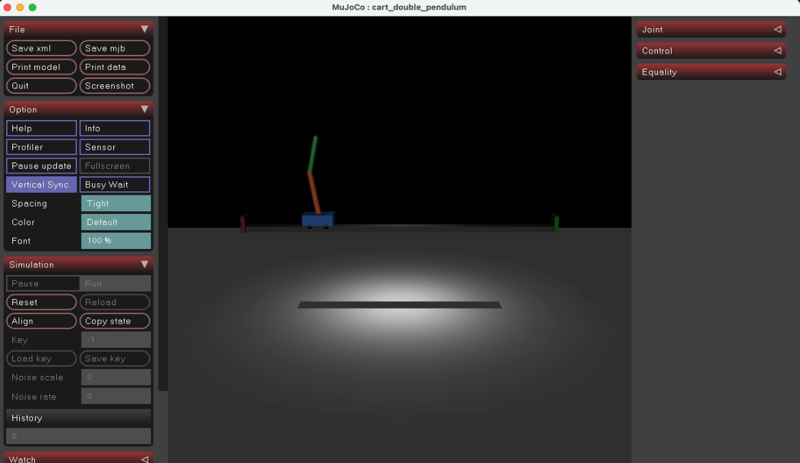
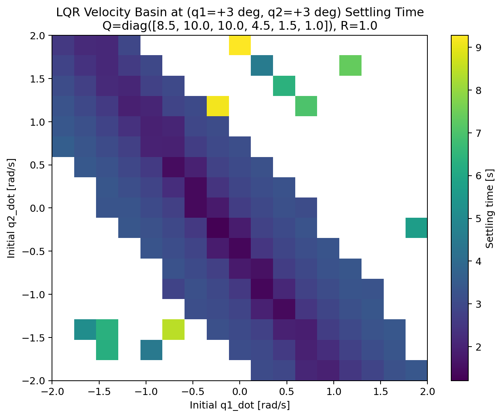

# Double Pendulum Swing-Up and Balance

## Introduction
The goal of this project was to control a cart-mounted double pendulum in simulation and drive it to the upright position using a horizontal force applied to the cart. This is a challenging underactuated control problem because both pendulum links must be controlled using only the horizontal motion of the cart. In this project, I implemented a two-phase controller consisting of swing-up from rest followed by local stabilization near the upright equilibrium. This report describes the system model, controller design, and validation results for both stages of the control pipeline.

## Model and Environment

The plant was modeled in MuJoCo as a planar cart-double-pendulum system consisting of a sliding cart, two pendulum links, and a single motor actuator applying horizontal force to the cart. The cart moves along a bounded rail, and each pendulum link is connected by a hinge joint. 

*Figure 1. MuJoCo simulation environment used for controller development and rollout visualization.*

The system state was defined as follows:

$$
x = [qpos, qvel] =
\begin{bmatrix}
x_{cart} & \theta_1 & \theta_2 & \dot{x}_{cart} & \dot{\theta}_1 & \dot{\theta}_2
\end{bmatrix}^T.
$$

*Figure 2. Planar cart-double-pendulum model and state definition. The second joint angle $\theta_2$ is defined relative to link 1, following the MuJoCo joint convention.*

> Note: We define the second joint angle as the angle relative to the first joint angle rather than the absolute world-frame angle, following MuJoCo's convention defined relative to the first link rather than the absolute world frame. In the rest of the report, we will distinguish between the the relative second-link angle and the absolute orientation of the second link when interpreting controller state.

The control input was a single horizontal cart force:

$$
u = \begin{bmatrix} F_{cart} \end{bmatrix}.
$$

This system is underactuated, since neither pendulum joint is directly actuated.

The main modeling assumptions are below:
- The motion was restricted to a planar 2D setting, so out-of-plane dynamics were ignored.
- The cart and pendulum segments were modeled as rigid bodies with fixed masses and lengths.
- The controller had access to the full simulated state, meaning perfect state measurement was assumed with no sensor noise, delay, or state-estimation error.
- The baseline simulation was deterministic, so disturbances and unmodeled effects were not included.

These assumptions allow us to model the critical dynamics of the double-pendulum system while removing some additional physics considerations such as flexible bodies to keep the project focused on the core control design.

The simulation parameters are as follows:
- cart track range: approximately `[-2.0, 2.0] m`
- actuator limit: `[-50, 50] N`
- simulation timestep: `0.005 s`
- cart mass: `1.0 kg`
- link 1 length / mass: `0.6 m`, `0.35 kg`
- link 2 length / mass: `0.5 m`, `0.25 kg`

## Controller Design

From a control perspective, the problem separates into a couple of distinct parts. The first is local stabilization near the upright equilibrium. The second is a swing-up from rest, where the controller must build pendulum motion to guide the system into the stabilizable region near the upright equilibium. Additionally, a handoff between the different control system might be needed so the swing-up controller can transfer control to the stabilization controller once the system is close to upright, without destabilizing the system.

### Stabilization Near Upright

For designing a control algorithm to stabilize the pendulum near an equilibrium. I primarily considered an LQR (linear quadratic regulator) approach. 

Near the upright equilibrium, the pendulum angles and velocities are small enough that the nonlinear dynamics of the system can be well approximated by a linear model. This makes a linear state-feedback design appropriate for stablization near upright, even though the full pendulum system may be nonlinear (https://underactuated.mit.edu/lqr.html). The controller also needs to be able to optimize across multiple coupled state errors (ie. the angle of the first and second pendulum links) rather than one single error term, which makes LQR suitable.

I briefly considered some alternate control approaches: 
- PID: PID does not work well when there are multiple important input states like we have here with the double pendulum (cart position, first angle, second angle), as PID mostly focuses on reducing one error term. 
- Pole Placement: Another linear control approach similar to LQR, but harder to tune, due to choosing eigenvalues being less interpretable and less intuitive
- More complex control methods could be considred but LQR met the needs of our controller design and was more straightforward to implement.

#### LQR Overview

The local linear dynamics used for LQR are written in discrete-time state-space form as

$$
x_{k+1} = A x_k + B u_k,
$$

where $x_k$ is the six-dimensional system state and $u_k$ is the cart-force input. 

The LQR controller then computes a state-feedback law

$$
u_k = -K x_k
$$

that minimizes the quadratic cost

$$
J = \sum_{k=0}^{\infty} \left(x_k^T Q x_k + u_k^T R u_k\right),
$$

where $Q$ penalizes state error and $R$ penalizes control effort.

#### LQR Implementation and Testing

In this project, I leveraged MuJoCo's discrete linearization at the upright reference state to compute the matrices local state-transition matrix $A$ and the input matrix $B$ MuJoCo uses a small perturbation size $10^{-6}$ on each of the state values to estimate how the system's next-step dynamics change with respect to the current state and input. Intuitively, MuJoCo computes how the next simulation step changes in response to small perturbations in the current state and input, which produces a discrete-time linear approximation around that operating point.

I chose to use a discrete-time linearization because it was consistent with the simulator, which made the implementation easier and also made the controller design more consistent with how real digital controllers are implemented (feedback updated at discrete intervals rather than in a true continuous nature).

The weighting matrices $Q$ and $R$ were then tuned to balance pendulum stabilization against actuator effort. I first tuned these weights manually by observing rollout behavior, then used parameter sweeps and validation runs to compare settling time, recovery success, and control effort across different rollouts.

### Swing-Up Policy

The next part of this project involves swinging up the pendulum from rest.
We need a way to swing the pendulum up. I considered several approaches here:

#### 1. Phase-based Swing Up
A phase-based swing-up strategy first considered, where cart forces were applied according to the pendulum’s motion phase rather than a direct energy estimate. In particular, force pulses were triggered near favorable parts of the swing to increase oscillation amplitude and move the system toward the upright region. However, the phase of a two pendulum system is much more complex than the phase of a single pendulum system, and the controller is highly sensitive to timing. It was difficult to tune this controller to get desired results.

#### 2. Energy-based Swing Up

Energy-based swing-up works by estimating the pendulum’s current mechanical energy, comparing it to the target energy required for the fully upright position, and then applying cart forces to either add energy or remove energy as needed (https://coecsl.ece.illinois.edu/se420/ast_fur96.pdf). So if the pendulum's total energy was less than the target energy, we could apply a cart force in a direction that will increase the oscillation amplitude, and if the pendulum's total energy was greater than the target energy, we could reduce the force being applied to damp the motion and slow the pendulum down to avoid overshooting the target.

The approach seemed promising because energy-based swing-up is a known startegy for balancing underactuated pendulum system. However, in practice, it ended up being pretty difficult to make this robust for a double pendulum system. The two links can exchange energy, and their coupled motion introduces more complex phase-dependent behaviors than in a single pendulum system. 

Approximating the energy of the system with the energy of the first link only proved insufficient, because it didn't consider the phase of the second link. When approximiating the energy of the system with the first and second link, the total energy became much harder to interpret and harder to use for control signals. In practice, the controller was highly sensitive to the timing and phase of the control inputs, and this usually created unstable behavior in the system.

#### 3. Cart Motion Swing Up

A heuristic controller was also explored. This controller is inspired by the deliberate left-right cart motion. This approach uses a state machine to move the cart between left and right waypoints while braking and reversing at controlled times. The main modes were drive_right, brake_right, hold_right, drive_left, brake_left, and hold_left.

This design was motivated by some physical intuition around what successful swing-up behavior looks like: the cart needs to move to the left/right quickly, stop quickly and allow the pendulum to swing to its apex, then reverse direction at useful times, while remainining within the limits of the rail (https://www.youtube.com/watch?v=e7669NPbENY). 

In practice, this approach was significantly easier to tune than the earlier swing-up attempts. Its behavior was also more interpretable in plots, since each controller mode had a clear purpose and the cart motion could be debugged directly.

This controller also tended to have relatively stable control inputs, which helped keep the second link from becoming too chaotic and putting the entire pendulum system into a state that would be hard to recover from. Although this approach is less principled and more brittle than a fully feedback-driven energy-based design, it was easier to structure, easier to visualize, and easier to tune into a repeatable nominal swing-up trajectory. For that reason, it became the final swing-up policy used in the project.

## Results

### LQR Stabilization Results

The LQR controller performed well near the upright equilibrium. I was able to tune the $Q$ and $R$ matrices manually based on physical intuition and watching the rollout behavior. Overall, I chose to penalize the pendulum angle states more heavily than the angular-velocity states, since keeping the links near upright was the most important local objective. I also included a penalty on cart position so that the stabilizing controller would not drive the cart into the rail limits. 

The final $Q$ and $R$ values were tested against a range of different initial angles with no initial angular velocity. The results show that the tuned paramters worked well in a wide range of initial angular positions.

*Figure 3. Zero-velocity angle basin for the final LQR controller, colored by settling time for successful recoveries. This makes the local recovery region visible while also showing how quickly the controller converges across the sampled angle neighborhood.*

The angle-basin plots were especially informative. With zero initial angular velocity, the final LQR controller recovered from a large portion of the tested upright neighborhood. Across the full $25 \times 25$ grid from $-12^\circ$ to $+12^\circ$ in both $q_1$ and $q_2$, 577 of 625 initial conditions were recovered successfully, corresponding to about $92.3\%$ success over that sampled region. In particular, every tested condition inside the square $|q_1| \le 9^\circ$, $|q_2| \le 9^\circ$ was recovered successfully. Failures began to appear primarily near the corners of the sampled region, especially when both angles were already large in magnitude. For successful recoveries, the measured settling times ranged from about $1.0\,s$ to $8.18\,s$, with an average of about $2.65\,s$.

*Figure 4. Velocity basin at the representative anchor $(q_1, q_2) = (3^\circ, 3^\circ)$. This plot shows how much residual angular velocity the LQR controller can tolerate at a near-upright angle state.*

I then extended the validation by adding initial angular velocity at several representative angle anchors. These velocity-basin plots showed a much smaller effective basin than the zero-velocity angle map. At $(q_1, q_2) = (3^\circ, 3^\circ)$, the controller recovered 150 of 289 tested velocity combinations, or about $51.9\%$. Similar recovery rates appeared at the other representative anchors, generally between $52\%$ and $56\%$. The most reliable region was concentrated near the origin in $(\dot{q}_1, \dot{q}_2)$ space, while larger residual velocities frequently pushed the system outside the local region where the linear approximation remained valid. In many of the unsuccessful cases, the simulation became numerically unstable, which is itself a useful indicator that the LQR controller had been driven well outside its basin of attraction.

## Overall Swing-up + LQR

Overall, I chose a two-phase swing-up plus LQR controller. The swing-up controller could reliably build momentum and bring the pendulum near the upright region, at which point the LQR controller could then stabilize the state once the system entered a sufficiently small capture region. Although the handoff itself was often quite aggressive, as the pendulum could enter the capture zone at a relatively high angular velocity, the controller was still capable of recovering and settling the pendulum.

I developed debuggging plots to help analyze the rollout of the swing-up + LQR policy. These plots showed cart position, link angles, angular velocities, control inputs, and controller mode transitions over time, which helped see exactly when the state machine changed modes and when the LQR handoff occurred. These visualizations were very helpful for understanding whether a bad rollout was caused by poor swing timing, excessive residual velocity at handoff, or an overly aggressive stabilization response and adjusting the policies.

*Figure 5. Full debug plot for a nominal swing-up plus LQR rollout. The plot was used to inspect cart motion, mode transitions, pendulum angles, velocities, and the timing of the LQR handoff.*

*Figure 6. Post-handoff behavior for the nominal swing-up plus LQR controller. This view highlights the near-upright transition and the stabilizing response after LQR takes control.*

These experiments showed the following:
- The swing-up controller could often reach a near-upright angle configuration, but not necessarily with low enough angular velocity for a clean handoff
- Direct handoff to LQR could work, but the resulting corrective action was often aggressive because the incoming state was still energetic
- the swing-up controller was very brittle and didn't tend to work well when you changed the parameters or the initial conditions even slightly

<!-- ## Analysis

There is an important tradeoff between controller structure and controller robustness.

The energy-based swing-up idea was interesting because it is a classic feedback-based strategy for underactuated pendulum systems. In principle, it offers a more adaptive mechanism than a fully hand-scripted state machine because the control law responds to the current mechanical energy rather than trying to replay one specific motion pattern. However, in this double-pendulum setting, that same idea became difficult to use reliably. The two links exchange energy, and the state of the second link strongly affects whether a given cart push is constructive or destructive. A controller based on the energy of only the first link was too crude to capture the full dynamics, while a controller based on the total energy of both links became harder to interpret and harder to map to a stable control action. In practice, small changes in phase or timing often caused the energy-based policy to inject force at the wrong moment, leading to highly unstable behavior.

By contrast, the final heuristic swing-up policy was much less principled but much easier to reason about. The state machine enforced a clear rhythm: drive toward a rail limit, brake, wait near the apex, and reverse direction. This did not solve the robustness problem, but it made the failure modes much more interpretable. When the controller failed, the debug plots usually showed whether the cart reversed too early, braked too hard, or handed off to LQR with too much residual velocity. That interpretability is a major reason the heuristic policy remained the final swing-up choice despite its brittleness.

The drawback is that this controller is strongly choreographed. It does not really compute a globally appropriate action from the current state; instead, it executes a sequence of hand-tuned behaviors that only tolerate limited deviation from the nominal motion. This explains several observed behaviors:
- small parameter changes could qualitatively change the swing-up trajectory
- small initial-angle perturbations could noticeably degrade performance
- the handoff to LQR often occurred at similar angle states but with residual velocity that remained difficult to reduce

Taken together, the results suggest that the local stabilizer was not the main weakness of the final system. The LQR validation showed a fairly broad angle basin and a meaningful but limited velocity basin near upright. The larger weakness was the swing-up stage, which could bring the pendulum close to upright but not always in a sufficiently calm, repeatable state for an easy handoff. In other words, the final system was limited more by the quality of the incoming swing-up state than by the capability of the LQR controller once that state entered the local basin. -->

### Limitations
- The controller assumed perfect state information. In simulation, the full state is available directly, but in a real system some states would need to be estimated rather than measured exactly.
- The controller also assumed ideal sensors with no noise or delay. Real sensing errors would likely reduce robustness, particularly for phase-sensitive swing-up logic and near-upright stabilization.
- The heuristic swing-up controller was highly sensitive to parameter changes and initial-condition perturbations. While it was effective in the nominal case, it did not exhibit a broad basin of attraction.
- The final control pipeline still relied on a fairly narrow handoff region between swing-up and LQR, which limited robustness.

## Conclusion

This project demonstrated a succesful two-phase controller for a cart-mounted double pendulum in MuJoCo: a heuristic swing-up policy to swing up from rest and an LQR controller to stabilize the system near the upright equilibrium. The final LQR design showed a strong local basin of attraction in angle space and a meaningful, though more limited, basin in angular-velocity space. These validation results gave a clear picture of where local stabilization was reliable and where the linear controller broke down.

The more difficult part of the project was swing-up. Although several approaches were considered, including phase-based and energy-based strategies, the final heuristic cart-motion controller proved to be the most practical because it was easier to interpret, easier to debug, and easier to tune into a nominally successful behavior. At the same time, the experiments also made clear that this controller was brittle and produced only a narrow handoff basin for the LQR stage.

### Next Steps

If this project were extended, the most important next step would be to improve robustness of the swing-up stage to work well under varying initial conditions and improve the swing-up phase to have a lower angular velocity approaching the upright position. Several interesting directions could be to:
- Add a dedicated catch or damping phase before LQR handoff so that the pendulum enters the stabilization basin with lower residual velocity
- Replace the hard-coded swing-up rhythm with a more feedback-driven controller, incorporating some ideas from energy-based feedback control to decide to pump more or less energy into the system based on the current state/current energy
- Test robustness under additional perturbations such as nonzero cart offsets, model mismatch, and measurement noise

## AI Usage
Codex was used to iterate on controller design, implement the controller code, and to draft the report. I was involved in reviewing all of the code and the report writeup, and I take full responsibility for all design decisions.
